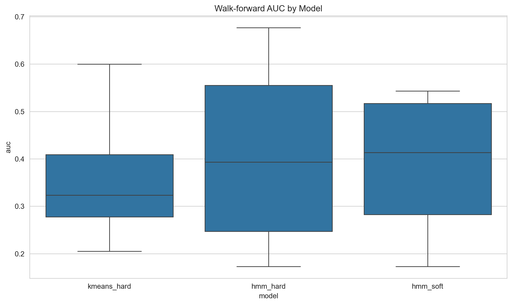
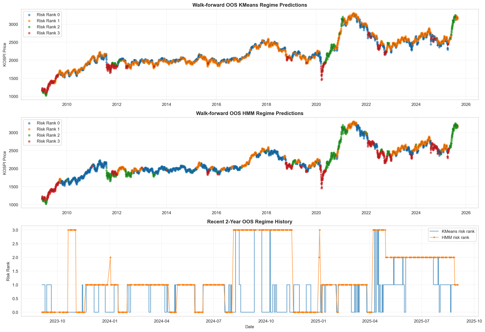

# 시장 레짐 분석 — KMeans · HMM 기반 ELD 합리성 평가

KOSPI-VKOSPI 데이터로 시장 국면(레짐)을 식별하고, 레짐별 ETF·정기예금·ELD의 기대 payoff를 정량 비교해 ELD 투자 합리성을 수치로 검증한 프로젝트.

## 핵심 결과

- HMM AUC **0.409** > KMeans **0.363** (Walk-forward 검증)
- 손실회피 계수 **λ ≥ 0.145** 이면 ELD가 ETF 상회함을 수치로 증명
- 현재 state 0 기준: ETF payoff 11.47% vs ELD 7.26% vs 예금 1.50%

## 방법론

| 단계 | 내용 |
|---|---|
| 데이터 | 2000–2026 KOSPI·VKOSPI 일별 데이터 |
| 변수 설계 | 1M·3M 수익률, 실현변동성, MDD, MA 이격도, VKOSPI z-score (7개) |
| 모델 | KMeans · HMM 4-state |
| 검증 | Walk-forward (AUC, Brier Score, Log Loss) |
| 효용함수 | U = mean − λ × loss prob (손실회피 모델) |

## 기술 스택

`Python` `hmmlearn` `scikit-learn` `pandas` `numpy` `matplotlib`

## 파일 구조

```
regime-project/
├── korean_market_regime_analysis.ipynb   # 전체 분석 노트북
├── data/                                  # 데이터
└── outputs/figures/                       # 결과 차트
```

## 결과 차트



